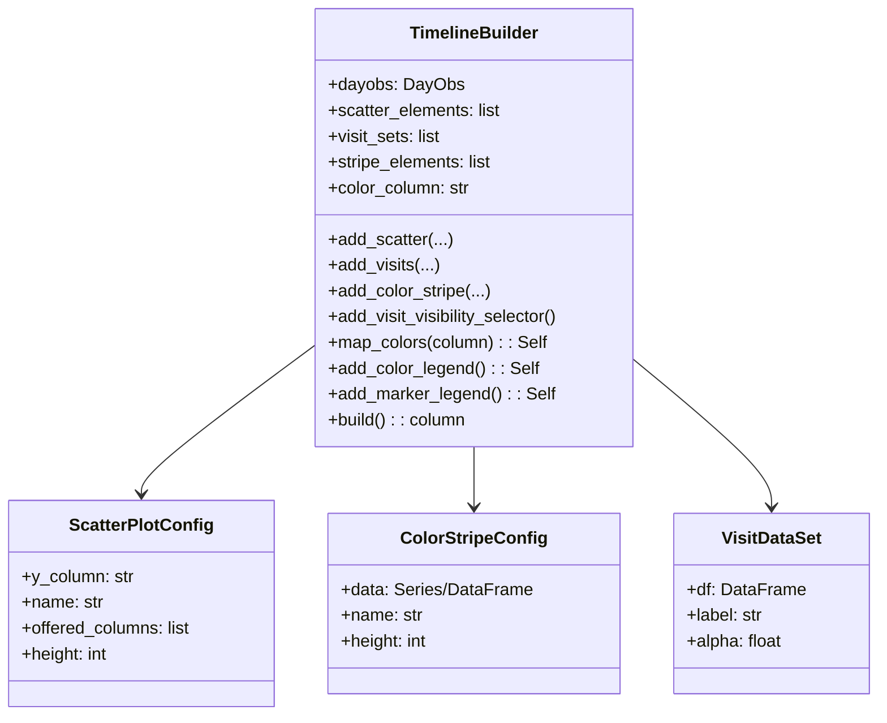

# Scope

## Identification

**Title:** Timeline Builder (tlbuilder) - A New API for Nightly Timeline Visualization
**Abbreviation:** tlbuilder

## Document overview

This document describes the Timeline Builder (tlbuilder) system, a new implementation of the timeline visualization functionality in the `schedview` library for the Rubin Observatory LSST scheduler.
The intended audience for this document includes:

- Scientists and operators who use timeline visualizations to inspect scheduler state and nightly observing plans
- Software developers maintaining and extending the schedview library
- Project managers and technical leads overseeing the development of visualization tools

This document outlines the shortcomings of the current timeline implementation (`schedview.plot.timeline`) and describes the design and operational concepts for the new `schedview.plot.tlbuilder` module, which will be implemented using a builder pattern to provide a cleaner, more flexible API.

## System overview

The Timeline Builder is a Python library component that provides tools for creating interactive timeline visualizations of events and visit parameters during a night of observations at the Rubin Observatory. The system takes as input time-series data (such as visit catalogs, sky brightness models, and astronomical event timings) and produces interactive Bokeh-based visualizations that can be displayed in Jupyter notebooks, embedded in HTML reports, or shown in web dashboards.

The system is part of the larger schedview visualization ecosystem, which follows a data flow pattern of:

```
collect → compute → plot → report
```

The tlbuilder component sits in the "plot" layer, consuming data from the "collect" and "compute" layers to produce visual outputs.

# Referenced documents

1. IEEE Std 1362-1998 (R2007) - Guide for Information Technology—System Definition—Concept of Operations (ConOps) Document
2. AGENTS.md - Guidance for AI coding assistants working with the schedview repository
3. schedview.plot.timeline module source code - Current timeline implementation
4. schedview.collect.visits module - Visit data collection
5. schedview.compute.astro module - Astronomical computations
6. rubin_scheduler package - Scheduler simulation and observation planning
7. Bokeh documentation - Interactive visualization library
8. Panel documentation - Web dashboard framework
9. RTN-092 (draft) - overview of schedview

# Current system or situation

## Background, objectives, and scope

The current timeline visualization system in `schedview.plot.timeline` (primarily the `TimelinePlotter` base class and `make_multitimeline` function) has accumulated several issues that make it increasingly difficult to maintain and extend:

1. **Overly complex and obscure API** - The current API uses a class inheritance pattern where users must define subclasses with class attributes to customize behavior. This is not intuitive for new users and makes the code difficult to understand and use.

2. **Limited layout flexibility** - The `make_multitimeline` function creates parallel timelines that share a common time axis, but there is no clean way to overlay different types of data (e.g., scatter plots with color-encoded stripes) on the same vertical space.

3. **Difficulty aligning events across plots** - When plotting visit parameters alongside non-visit parameters, the current implementation places them side-by-side rather than stacked with a common x-axis, making it difficult to correlate events.

4. **Dead code** - Several features in the current implementation are no longer used (e.g., some TimelinePlotter subclasses for specialized log event types that have been replaced by other tools).

The objective of the tlbuilder project is to create a new, clean-slate implementation that:

- Uses a fluent builder pattern for intuitive, step-by-step plot construction
- Supports stacked plots with a common x-axis for proper event alignment
- Provides a consistent API for different data types (scatters, stripes, visits)
- Is easier to maintain and extend

## Operational policies and constraints

1. The system must run on the same platforms as the rest of schedview (Linux, macOS).
2. The output must be compatible with the existing Bokeh/Panel ecosystem used throughout schedview.
3. The implementation must be compatible with both Python 3.11+ (current schedview requirement).
4. The system must work in Jupyter notebooks, static HTML generation, and Panel web dashboards.
5. Must coexist with the existing `schedview.plot.timeline` module during the transition period.

## Description of the current system or situation

The current timeline system is implemented in `schedview/plot/timeline.py` and consists of:

1. **TimelinePlotter** - A base class that creates generic timeline plots from Bokeh ColumnDataSources or pandas DataFrames. Subclasses customize behavior through class attributes like `key`, `time_column`, `factor`, and `glyph_class`.

2. **Subclasses** - Specialized plotter classes for different data types:
   - `LogMessageTimelinePlotter` - For log messages
   - `SchedulerDependenciesTimelinePlotter` - For scheduler dependency events
   - `BlockStatusTimelinePlotter` - For block status changes
   - `VisitTimelinePlotter` - For visit data with band-colored bars
   - `SunTimelinePlotter` - For sun events (sunset, sunrise, twilight)
   - `ModelSkyTimelinePlotter` - For model sky brightness
   - And more...

3. **make_multitimeline** - A function that takes multiple data sources as keyword arguments and creates a combined plot with parallel timelines. The keyword argument names map to the `key` attribute of TimelinePlotter subclasses.

4. **make_timeline_scatterplots** - A higher-level function that creates side-by-side plots of a timeline and a scatter plot of visit parameters vs. time.

The current system has these characteristics:

- Uses `bokeh.plotting.figure` for plot creation
- Uses `bokeh.models.ColumnDataSource` for data binding
- Uses `bokeh.models.plots.Plot` for the core plot object
- Relies on `bokeh.transform` for color mapping and axis transformations

## Modes of operation for the current system or situation

The current system can operate in the following modes:

1. **Jupyter notebook mode** - Plots displayed in Jupyter notebooks with interactive widgets (zoom, pan, hover tooltips). This includes generation of static HTML pages for static reports, or through Times Square.

2. **Static HTML mode** - Plots rendered to HTML files using `bokeh.embed.file_html()`.

3. **Dashboard mode** - Plots embedded in Panel web dashboards using `panel.pane.Bokeh`.

# Justification for and nature of changes

## Justication of changes

The current timeline implementation has several deficiencies that justify a complete rewrite:

1. **API Complexity** - The class-based approach with inheritance is not intuitive. New users must understand class attributes, method overriding, and the relationship between different subclasses. This creates a steep learning curve.

2. **Layout Limitations** - The inability to stack different plot types with a common x-axis forces workarounds that are fragile and difficult to maintain. Users frequently request the ability to show visit scatters with overlaid color stripes for context.

3. **Code Maintainability** - The inheritance hierarchy makes it difficult to add new features. Each new plot type requires creating a new subclass with all the boilerplate that entails.

4. **Dead Code** - Several TimelinePlotter subclasses are no longer used but remain in the codebase, adding to maintenance burden and confusing new users.

The desired changes will provide:

- A cleaner, more intuitive API using the builder pattern
- Better layout capabilities with stacked plots
- Easier maintenance.

## Description of desired changes

The new tlbuilder module (`schedview.plot.tlbuilder`) will implement:

1. **TimelineBuilder class** - A fluent API where users add elements to a plot using a sequence of method calls:

   ```python
   builder = TimelineBuilder(dayobs)
   builder.add_scatter(...)
   builder.add_visits(...)
   builder.add_color_stripe(...)
   plot = builder.build()
   ```

2. **Stacked plot support** - Multiple plots sharing a common x-axis, allowing different data types to be vertically stacked while maintaining temporal alignment.

3. **Visit data support** - Special handling for pandas DataFrames from `schedview.collect.visits.read_visits()` with:
   - Configurable time column (default: `observationStartMJD`)
   - Configurable plot parameters (alpha, marker, etc.)
   - Visibility toggles for multiple visit sets

4. **Color mapping support** - A single `map_colors(column)` method on `TimelineBuilder` configures how visit points are colored across all scatter plots:
   - When `column="band"` (the default), uses the standard LSST band palette (`PLOT_BAND_COLORS`) preserving current behavior
   - When `column` names any other string column, uses the Bokeh `Colorblind` palette
   - If the column has more distinct values than the palette supports, the least-common values are collapsed into a single `"other"` bin before mapping
   - The mapping applies uniformly to every scatter panel produced by `build()`

5. **Color stripe support** - For background color mapping of continuous quantities:
   - Sun elevation (`--background sun_elevation`)
   - Moon elevation (`--background moon_elevation`)
   - Sky brightness (custom data series)
   - Default height of 40px for better visibility

6. **Interactive controls** - Built-in widgets for:
   - Y-axis column selection for scatter plots (via Select widget with offered_columns)
   - Visit set visibility toggles (via MultiChoice widget)
   - Zoom/pan interactions (via Bokeh built-in tools)

7. **CLI tool** - A command-line interface for generating standalone HTML files:
   ```bash
   buildtl --date 2026-05-23 --scatter altitude --scatter HA --visits baseline_v1.db --visits baseline_v2.db --background sun_elevation --output timeline_2026-05-23.html
   ```

## Priorities among changes

**Essential features:**

1. Builder pattern API with fluent method chaining
2. Support for pandas DataFrame visit data
3. Stacked plots with common x-axis
4. Color stripe background for continuous quantities
5. Y-axis column selector for scatter plots
6. Visit set visibility toggles
7. Test suite with comprehensive coverage

**Desirable features:**

1. CLI tool for HTML generation
2. Support for custom color maps
3. Hover tooltip customization
4. Export to PNG/PDF

## Changes considered but not included

1. **Complete removal of the old timeline module** - The old `schedview.plot.timeline` will remain in place during the transition period to avoid breaking existing code. A deprecation warning will be added to guide users toward the new API.

2. **Full compatibility with all existing TimelinePlotter subclasses** - The new API will not support all the specialized plotter types (e.g., SchedulerDependenciesTimelinePlotter) that are no longer used. Users of these will be directed to alternative approaches.

3. **Configuration file support** - Initial implementation will focus on programmatic API. Configuration file support may be added later if needed.

4. **Color stripe default height** - The implementation uses 40px as default stripe height (instead of 20px) for better visibility.

# Concepts for the proposed system

## Background, objectives, and scope

The proposed tlbuilder system is a complete rewrite of the timeline visualization functionality in schedview. It is designed to address the limitations of the existing implementation by adopting a modern builder pattern and providing better support for stacked, aligned visualizations.

The system will be implemented in a new module `schedview.plot.tlbuilder` to allow coexistence with the existing implementation during the transition. Once the new API is stable and all users have migrated, the old module can be deprecated and eventually removed.

## Operational policies and constraints

1. The new implementation must use the same underlying Bokeh library as the existing code.
2. All plot elements must be compatible with Panel dashboards.
3. The API must be documented following the LSST numpydoc style.
4. All public functions and classes must have test coverage.
5. The implementation must not break existing code that depends on `schedview.plot.timeline`.

## Description of the proposed system

The proposed system consists of:

1. **TimelineBuilder** - The main class that provides the builder API. Users create an instance, add plot elements using methods like `add_scatter()`, `add_visits()`, and `add_color_stripe()`, then call `build()` to produce the final Bokeh layout.

2. **Builder methods** - Each method adds a specific type of element to the plot:
   - `add_scatter()` - Add a scatter plot with y-axis selector
   - `add_visits()` - Add visit data as scatter points
   - `add_color_stripe()` - Add a horizontal bar for color-coded data (default height: 40px)
   - `add_visit_visibility_selector()` - Add a widget to toggle visit set visibility
   - `map_colors(column)` - Set the visit column used for color encoding across all scatter panels (default: `"band"`)
   - `add_color_legend()` - Append a dedicated legend figure at the bottom mapping colors to values
   - `add_marker_legend()` - Append a marker legend to the same bottom figure mapping marker shape to visit set name

3. **Data types supported**:
   - `pandas.DataFrame` with time column (default: `observationStartMJD`)
   - `pandas.Series` with MJD index for continuous data (e.g., sky brightness)
   - Data from `schedview.compute.astro.night_events()` for sun/moon events
   - Data from `rubin_scheduler.site_models.Almanac.get_sun_moon_positions()` for astronomical positions

4. **Output formats**:
   - Bokeh layout for embedding in notebooks and dashboards
   - HTML file for standalone reports
   - Panel components for interactive dashboards

## Modes of operation

The proposed system supports the same operational modes as the current system:

1. **Notebook mode** - Plots created in Jupyter notebooks with interactive widgets
2. **HTML export mode** - Plots saved to HTML files using `bokeh.embed.file_html()`
3. **Dashboard mode** - Plots embedded in Panel web dashboards
4. **CLI mode** - Standalone HTML files generated from command line

## Support environment

The system will run in the same environments as schedview:

- Jupyter notebooks (local and remote)
- Panel web dashboards
- Command-line tools
- HTML reports generated by nbconvert

# Operational scenarios

## Generation of a stand-alone figure in html

A user wants to generate a standalone HTML timeline report for a specific night:

1. The user runs the CLI command:

   ```bash
   buildtl --date 2026-05-23 --scatter altitude --scatter HA --visits baseline_v1.db --visits baseline_v2.db --background sun_elevation --output timeline_2026-05-23.html
   ```

2. The command:
   - Collects the date from the command line
   - Determines the DayObs for the date
   - Collects visit data from the specified visit sources (OpSim databases, parquet files, or 'baseline')
   - Computes sun/moon positions for background stripes
   - Builds the timeline using the default configuration
   - Saves the HTML file using Bokeh's embedding tools

3. The user can share the HTML file with collaborators, who can open it in any modern web browser without needing Python or Jupyter.

## Generation of a figure in a jupyter notebook

A user wants to create an interactive timeline visualization in a Jupyter notebook:

1. The user imports the necessary modules:

   ```python
   from schedview.plot.tlbuilder import TimelineBuilder
   from schedview.dayobs import DayObs
   from schedview.collect.visits import read_visits
   ```

2. The user creates a DayObs and builds the timeline:

   ```python
   dayobs = DayObs.from_date('2026-05-23')
   builder = TimelineBuilder(dayobs)

   # Add scatter plots with y-axis selector
   builder.add_scatter(y_column='fieldRA', name='ra_plot', offered_columns=['HA', 'fieldRA', 'fieldDec'])
   builder.add_scatter(y_column='fiveSigmaDepth', name='depth_plot')

   # Add visit data
   visits_v1 = read_visits(dayobs, 'baseline_v1')
   builder.add_visits(visits_v1, label='v1')

   visits_v2 = read_visits(dayobs, 'baseline_v2')
   builder.add_visits(visits_v2, label='v2', alpha=0.5)

   # Add background color stripes
   sky = get_median_model_sky(dayobs)
   builder.add_color_stripe(sky, name='sky_brightness', height=40)

   # Add interactive widgets
   builder.add_visit_visibility_selector()

   # Build and display the plot
   p = builder.build()
   from bokeh.io import show
   show(p)
   ```

3. The notebook cell displays an interactive plot with:
   - Multiple stacked plots with aligned time axes
   - Y-axis dropdowns for scatter plot column selection
   - Visit visibility toggles
   - Full Bokeh interactivity (zoom, pan, hover)

## Inclusion of a timeline in an interactive dashboard

A user wants to include a timeline visualization in a Panel dashboard:

1. The user creates a Panel dashboard with interactive controls:

   ```python
   import panel as pn
   pn.extension()

   dayobs_selector = pn.widgets.DatePicker(name='Day Obs')
   visit_source_selector = pn.widgets.Select(name='Visit Source', options=['baseline_v1', 'baseline_v2'])

   @pn.depends(dayobs_selector, visit_source_selector)
   def create_timeline(dayobs_date, visit_source):
       if dayobs_date is None:
           return pn.pane.Markdown("Please select a date")

       dayobs = DayObs.from_date(str(dayobs_date))
       builder = TimelineBuilder(dayobs)

       # ... build timeline using visit_source ...

       return pn.pane.Bokeh(builder.build())

   dashboard = pn.Column(
       pn.Row(dayobs_selector, visit_source_selector),
       pn.panel(create_timeline)
   )
   dashboard.servable()
   ```

2. The dashboard is served using `panel serve` and can be accessed via a web browser.

3. Users can interactively change the day obs and visit source, and the timeline updates automatically.

# Analysis of the proposed system

## Summary of improvements

The tlbuilder system provides the following improvements over the current implementation:

1. **Simpler API** - The builder pattern is more intuitive than class inheritance. Users write a sequence of method calls rather than defining subclasses.

2. **Better layout** - Stacked plots with common x-axis allow proper alignment of events across different data types.

3. **More flexible** - The fluent API allows users to easily combine different plot types and customize their appearance.

4. **Better visit support** - Special handling for visit DataFrames with automatic band coloring and configurable parameters.

5. **Easier maintenance** - The new codebase is cleaner and more modular, making it easier to add new features.

6. **Interactive widgets** - Built-in MultiChoice and Select widgets for visit visibility toggling and y-axis column selection.

7. **CLI tool** - Standalone HTML generation without needing to write Python code.

## Disadvantages and limitations

1. **Migration cost** - Existing code using `schedview.plot.timeline` will need to be updated to use the new API.

2. **Learning curve** - While simpler than the old API, users still need to learn the new builder pattern.

3. **Limited feature parity** - Some specialized TimelinePlotter subclasses may not have direct equivalents in the new API.

4. **Bokeh dependencies** - The system remains dependent on Bokeh, which can be large and complex.

# Notes

## Acronyms and abbreviations

- **MJD** - Modified Julian Date
- **OpSim** - Observation simulation database
- **LSST** - Legacy Survey of Space and Time
- **Rubin** - Rubin Observatory (formerly LSST)
- **Bokeh** - Interactive visualization library for Python
- **Panel** - Web dashboard framework for Python
- **ConOps** - Concept of Operations

## Additional information

This ConOps document was created using the IEEE Std 1362-1998 format for Concept of Operations documents.

The tlbuilder implementation will follow the schedview coding conventions as documented in AGENTS.md, including:

- NumPy-style docstrings
- 110 character line length
- Black and isort for formatting
- Ruff for linting
- Comprehensive test coverage

# Time handling

The tlbuilder uses Modified Julian Date (MJD) values from the scheduler for time input, but Bokeh requires datetime types for proper time-axis handling. The conversion and formatting follow Bokeh's conventions:

- **Input**: Time data comes as MJD (float) from `schedview.collect.visits.read_visits()` and `schedview.compute.astro` functions
- **Internal conversion**: MJD values are converted to `numpy.datetime64` type when creating `ColumnDataSource` objects
- **X-axis type**: Bokeh figures use `x_axis_type="datetime"` for proper time-axis rendering
- **Tick formatting**: The x-axis uses `DatetimeTickFormatter` with `hours="%H:%M"` to display time of day in HH:MM format

# Design

---

Great — I now have the contents of `tlbuilder.py` and the conceptual design document `tlbuilder.md`. Below is a **senior‑engineer–level software design document**, written in Markdown, inspired by **IEEE‑1016**, **IEEE‑1471**, and **UML design practices**. It references and synthesizes the code and conceptual material you provided, without repeating either file verbatim.

If you'd like, I can also produce a PDF‑ready version, split the document into multiple files, or generate a corresponding architecture diagram set.

---

# Design

## Overview

The Timeline Builder is positioned in the **plotting layer** of schedview, consuming time-series data (visit tables, astronomical event computations, continuous elevation data, etc.) and producing interactive Bokeh layouts for notebooks, dashboards, or HTML export.

The system integrates with:

- `schedview.dayobs.DayObs` for nightly time boundaries.
- Visit ingestion tools (e.g., `read_visits()`).
- Astro‑compute functions (sun/moon elevation, sky brightness).
- Bokeh models (Figure, ColumnDataSource, Select, MultiChoice, CustomJS, etc.).

## Architecte

### Module Structure

```
tlbuilder/
 └── tlbuilder.py
       - ScatterPlotConfig
       - ColorStripeConfig
       - VisitDataSet
       - BAND_COLORS
       - TimelineBuilder
       - build_timeline()
       - main()  (click CLI)
```

### Primary Components

#### TimelineBuilder

A stateful builder responsible for:

- holding references to all plot elements to be composed,
- generating Bokeh models,
- enforcing vertically stacked layout with shared x-axis ranges,
- optional creation of widget controls.

#### ScatterPlotConfig / ColorStripeConfig

Typed parameter bundles for controlling plot appearance. `ScatterPlotConfig` now includes a `color_column` field (default `"band"`) that specifies which visit column drives color encoding for overlaid visit points.

#### VisitDataSet

Represents a visit source’s associated data, label, and stylistic options. The `color_by_band` field has been removed; color encoding is now determined by each scatter plot’s `color_column`.

## Design Viewpoints

### Logical View

#### Class Diagram



### Data View

#### Data Sources and Conversions

- **Input formats**
  - Visit tables: pandas DataFrames with MJD time columns.
  - Background data: pandas Series/DataFrames.
  - Astronomical event tables: numeric or datetime fields.

- **Internal**
  - All temporal values converted to `numpy.datetime64` for compatibility with Bokeh’s `x_axis_type="datetime"`.

- **Derived values**
  - Color encoding resolved via a single builder-level `color_column` (set by `map_colors()`; default `"band"`):
    - `"band"` → `PLOT_BAND_COLORS` (standard LSST band palette)
    - any other string column → Bokeh `Colorblind` palette; least-common values collapsed to `"other"` when distinct count exceeds palette size
  - The same mapping is applied to every scatter panel; there is no per-panel override.
  - ColumnDataSource used universally for binding.

## Detailed Component Design

### TimelineBuilder

#### Responsibilities

- Manage element configuration.
- Create consistent shared x-axis.
- Hold a single builder-level `color_column` (default `"band"`) configurable via `map_colors()`.
- Build Bokeh figures and glyphs, applying the color mapping uniformly across all scatter panels.
- Optionally add widgets (Select, MultiChoice).
- Optionally append a horizontal color legend and/or marker legend to a shared figure at the bottom of the layout.
- Produce a single Bokeh `column` layout.

#### Key Internals

- Holds lists: `scatter_elements`, `visit_sets`, `stripe_elements`.
- Transforms MJD→datetime64 on ingestion.
- `_build_color_mapper()` — called once per `build()` invocation; constructs the `CategoricalColorMapper` and mutates visit sources to add the `"other"` bin when needed.  All scatter figures receive the same mapper instance.
- Uses Bokeh glyphs:
  - `Scatter` for visit/scatter data,
  - `LinearColorMapper` or `CategoricalColorMapper`,
  - `Range1d` for shared x-axis ranges,
  - `Legend` / `LegendItem` for the optional color legend and marker legend panels, both attached to a single shared bottom figure.

#### Error Handling

- Validates required columns exist in visit/scatter datasets.
- Ensures consistent time bounds relative to DayObs.

### Scatter Plot Support

Each scatter plot:

- Has its own y-axis but shares an x-axis.
- May include a y-axis selector widget (Select → CustomJS callback).
- Respects user-specified height (default from CLI).

### Visit Data Support

- Accepts multiple visit sets; `add_visits()` does not accept `color_by_band`.
- Color encoding is resolved at `build()` time using the builder-level `color_column` set by `map_colors()` (default `"band"`):
  - `"band"` → `PLOT_BAND_COLORS` (existing LSST palette, preserving current behavior)
  - any other string column → Bokeh `Colorblind` palette with automatic `"other"` binning for overflow values
- The same color mapping is applied to visit points across all scatter panels.
- Each visit set can be toggled in visibility with a MultiChoice widget (optional).

### Color Legend

When `add_color_legend()` has been called, `build()` appends a dedicated thin figure at the bottom of the layout:

- The figure has `height=1`, no axes, no toolbar, and no outline, so it renders only the legend itself.
- A Bokeh `Legend` with `orientation="horizontal"` is attached via `fig.add_layout(legend, "below")`.
- Each `LegendItem` corresponds to one factor from the `CategoricalColorMapper`.  The item uses a hidden `Scatter` renderer carrying the correct swatch color.
- If the color column required an `"other"` bin (more distinct values than the `Colorblind` palette supports), an `"other"` item is included with gray (`#888888`).
- The legend figure is only created when a `CategoricalColorMapper` exists (i.e., at least one visit set contains the color column).  If there are no visit sets or the color column is absent, `add_color_legend()` is a no-op at render time.

### Marker Legend

When `add_marker_legend()` has been called, `build()` attaches a second horizontal `Legend` to the same shared bottom figure used by `add_color_legend()`:

- Each `LegendItem` corresponds to one `VisitDataSet`, using that dataset's marker shape and label (visit set name) as the swatch.
- If neither `add_color_legend()` nor `add_marker_legend()` was called, no bottom figure is created.
- If only one of the two is called, only that legend is attached and the shared figure is still created.
- When both are called, both legends are attached to the same `height=1` figure: the color legend is added first (`"below"`), then the marker legend is appended alongside it.
- The marker legend is only created when at least one `VisitDataSet` has been added; if there are no visit sets it is a no-op at render time.

### Color Stripes

- Represent continuous background fields (sun elevation, moon elevation, sky metrics).
- Rendered using small-height horizontal plots (default = 40px per tlbuilder.md).
- Always stack at the top or bottom depending on builder order.

### CLI Tool

`main()` provides:

- Date selection.
- Multiple scatter columns (`--scatter ...`).
- Multiple visit sources (`--visits ...`).
- Background stripe selection (`--background sun_elevation`).
- Output HTML file path.
- Optional widget enablement.

Defined via `click` decorators in `tlbuilder.py`.
