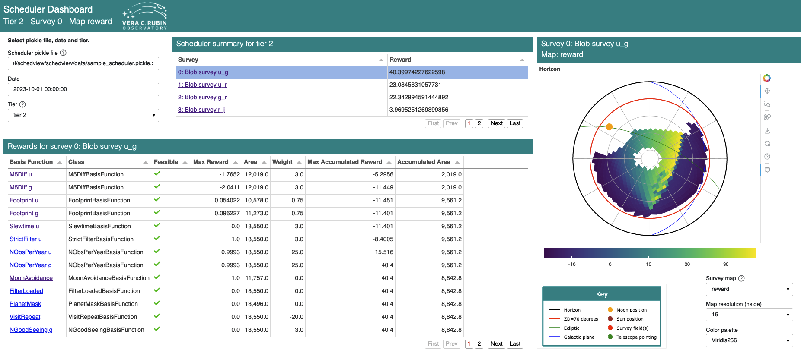
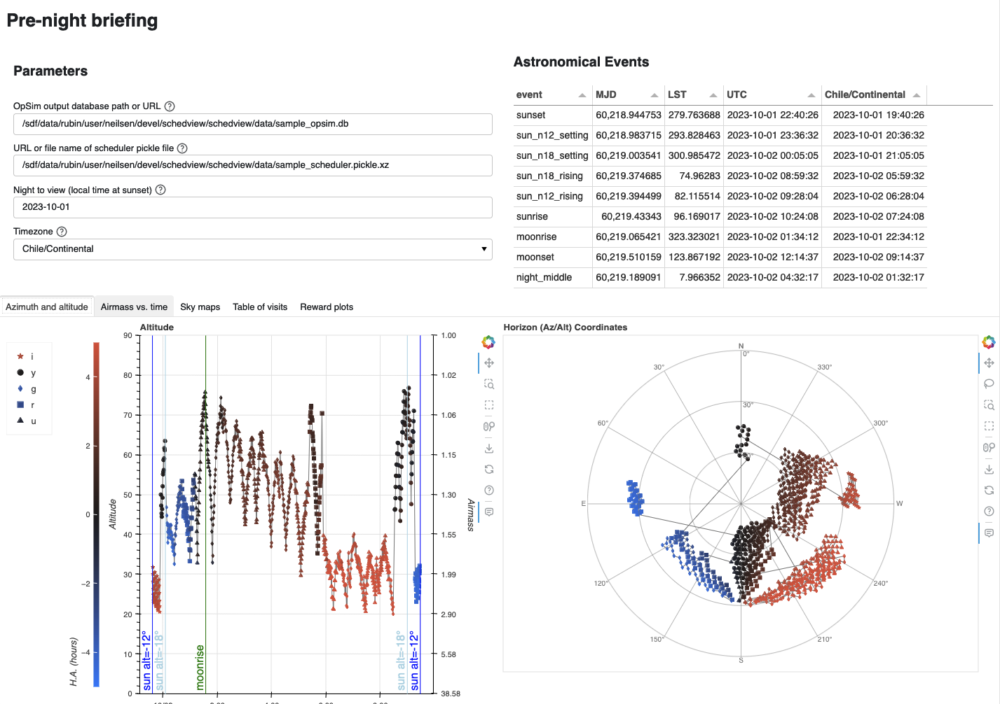

Introduction
============

``schedview`` is a collection of tools for visualizing Rubin Observatory scheduler behaviour and LSST survey status.
`RTN-016: Background and concepts for monitoring survey progress and scheduler performance <https://rtn-016.lsst.io/>`_ describes the motivation for the construction of these tools, including some of the use cases for which they are intended and example of current and planned visualizations.

The ``schedview`` module includes web applications that supply dashboards designed for the common use cases found in `RTN-016 <https://rtn-016.lsst.io/>`_.
These web applications can either be run on a surver, where they can be used by multiple users; or locally, including customization with additional plots.
In addition to the pre-built web applications, the supporting functions and classes are intended to be usable either as parts of other applications, or in jupyter notebooks.

``schedview`` presently supplies two dashboards:

* ``scheduler_dashboard``, a dashboard for examining the state of a the scheduler an a specific time, intended for using during the night to give insight into the schedulers current behavior.
  The ``scheduler_dashboard`` shows maps and relevant statistics for all basis functions and rewards for all surveys, given a time and an instance of the scheduler.
* ``prenight``, a dashboard for preparing for a night of observing.
  Visualizations included in this dashboard are intended to help schedulers and observing staff understand what the scheduler will do in a night, given the output of a simulation of the night (as created by `rubin_sim`).
  Elements include:

  * A table of astronomical events (sunrise, sunset, moonrise, moonset, etc.)
  * Maps of visit locations in both horizon (az./alt.) and equatorial (R.A./decl.) coordinates.
  * Plots of altitude and airmass with time.
  * A table of the visits themselves, with basic parameters.
  * Summary plots of scheduler basis function parameters, including feasibility and maximum values vs. time for each basis function of each survey, as calculated during the simulation.

The ``scheduler_dashboard`` looks like this:

The ``prenight`` dashboard looks like this:

In addition to the default set of plots, the ``prenight`` dashboard supports adding custom plots to the dashboard.
Simple plots can be added by supplying parameters for `hvplot <https://hvplot.holoviz.org/>`_ in a yaml file, or by creating a subclass of the dashboard applications class with additional plotting code.

In addition, the various python functions these dashboard uses to create its plots are designed to be called in other contexts as well.
For example, they may be used in jupyter notebooks or inside other python applications.
See the sample jupyter notebooks in the :code:`notebooks` subdirectory of the project repository.
